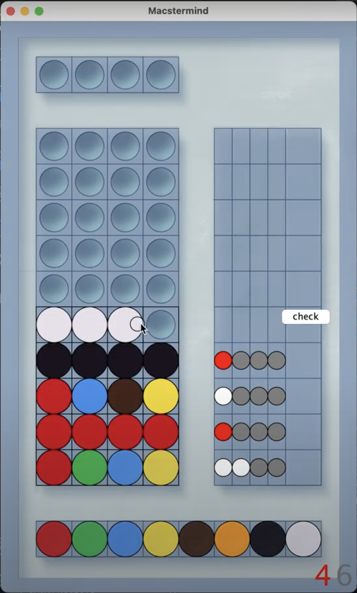
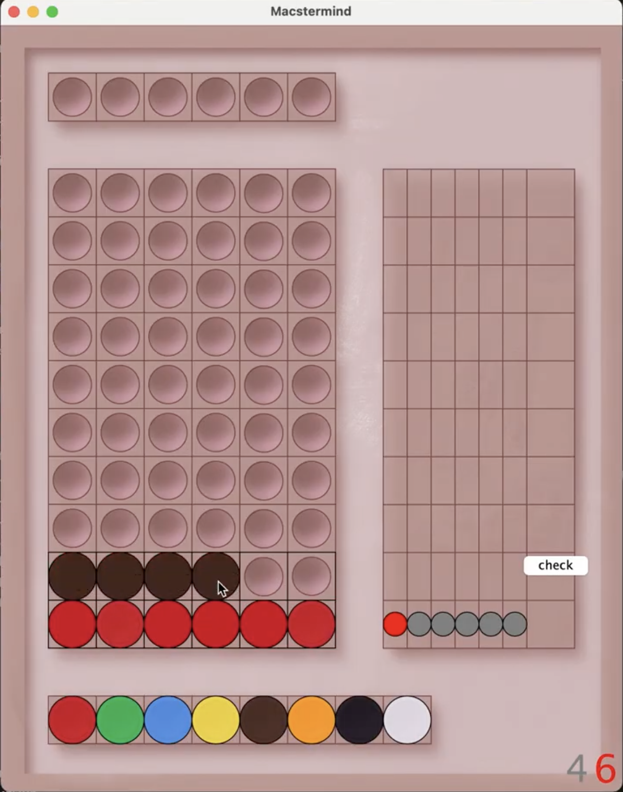

# Macstermind
Authors: Lewis and Keating

# How to play the game
Welcome to Macstermind! This is a fully playable version of the classic board game Mastermind, created using Kilt Graphics. To begin play, simply run the program. Your ultimate goal is to guess a hidden code of colored balls by making guesses and getting feeback in the form of pegs which tell you how close you are to the correct code. Fill your guess by clicking the balls at the bottom of the screen, then clicking to place them in the current row. when you're ready, click the "Check Guess" button. On the right you'll see a series of pegs that can be gray, white, or red. Each red peg means that one ball in your guess is the right color in the right position, each white peg means that a ball in your guess is the right color in the wrong position, and each gray peg means that a ball in your guess is the wrong color completely. You have ten guesses to guess the right answer. Looking for a challenge? Click the 6 button in the bottom right corner to switch to a board where the code is 6 balls long. Good luck!

# Screenshots 
Gameplay with four ball codes:

Gameplay with six ball codes:

# Known bugs
Clicks are sometimes not registered due to kilt graphics mouse events

# The Project Proposal:

## What is this project?
We're going to be creating a playable version of the board game Mastermind with a full GUI. Mastermind is logic game where the player must discern a hidden code by making guesses and recieving feedback in the form of pegs which denote whether the guessed code has any colors in common with the goal. Too many incorrect guesses and you lose!

## Why this project?
We chose this project because it's an interesting game that will be satisfying to play when completed. It's also good that the core gameplay is fairly simple, allowing us to polish and expand if we have time. This will let us make a final product we're actually proud of. 

## What inspired this?
This project was inspired by the in class activity where we created a uml diagram for Mastermind. It was an interesting set of problems to solve so we thought it would be fun to keep working on it. Making it fully playable with a proper gui seemed like the natural next step. 

## Resposiblities: 
(roughly speaking)
Keating: Create Visuals and GUI
Lewis: Code gameplay rules

## Action plan:
create data structures for codes -- completed
Implement random code generator -- completed
Implement basic guessing functionality -- in progress
Create visual layout
Implement user input via GUI
Implement graphical codes
Implement feedback
Implement feedback visuals
Implement win/lose conditions

Stretch goals:
Rule variants - duplicates, adjust code length, etc.
Polish - expanded feedback for user input, flashy visuals, etc.
